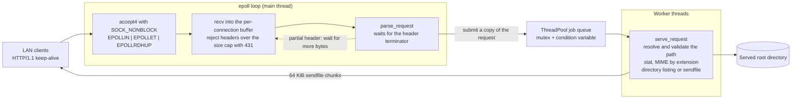
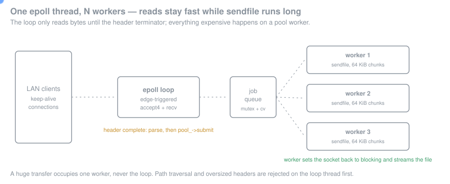

# localshare

Single-binary HTTP/1.1 file server in C++17. Linux **epoll** for non-blocking,
event-driven accept + read; a small thread pool dispatches request handling
so disk I/O and large `sendfile()` transfers don't stall the event loop.
Designed to expose a local directory to colleagues — directly on the LAN, or
remotely via an SSH reverse tunnel — without any cloud or container
infrastructure.

## What it does

- **GET / HEAD** for any file under the configured root.
- **Auto-generated HTML directory listings** (toggleable).
- **MIME detection** by extension for ~25 common types.
- **Streaming via `sendfile(2)`** in 64 KiB chunks — large files don't have to
  fit in memory, and the kernel skips a userspace copy.
- **HTTP/1.1 keep-alive**.
- **Path traversal rejected** (`..` segments and percent-encoded NULs are
  refused before the filesystem is touched).
- **Clean shutdown on SIGINT/SIGTERM**.

## Architecture






The epoll thread only **reads bytes** until the request header is complete
(detected by `\r\n\r\n`). Once parsed, the work is handed to a thread-pool
worker that switches the socket back to blocking mode and streams the file.
This keeps the accept/read loop responsive under hundreds of concurrent
connections without writing a fully async file-send pipeline.

## Prerequisites

- Linux (uses `epoll`, `accept4`, `sendfile`)
- C++17 compiler (GCC 8+, Clang 7+)
- pthreads
- CMake 3.20+ *or* plain `g++`

## Build

With CMake:

```bash
cmake -B build
cmake --build build
./build/localshare --help
```

Without CMake:

```bash
g++ -std=c++17 -O2 -Iinclude src/*.cpp -lpthread -o localshare
./localshare --help
```

## Run

```bash
# Serve the current directory on :8080
./localshare

# Serve a specific dir on :9000, bind only to localhost, 8 workers
./localshare -p 9000 -b 127.0.0.1 -w 8 ~/Downloads

# Disable directory listings (404 on missing index.html)
./localshare --no-autoindex /var/www
```

### Flags

```
-p, --port N         port to bind (default 8080)
-b, --bind ADDR      bind address (default 0.0.0.0)
-w, --workers N      worker threads (default 4)
    --no-autoindex   disable directory listings
-h, --help           print this help
```

Send SIGINT (Ctrl-C) or SIGTERM to stop.

## Exposing the server remotely (SSH reverse tunnel)

`localshare` itself is LAN-only — there's no auth or TLS. To make a directory
accessible from outside the network, terminate TLS/auth at a public box you
already trust (a small VPS, your office bastion, etc.) and reverse-tunnel
back to localshare:

```bash
# On the laptop running localshare:
./localshare -b 127.0.0.1 -p 8080 ~/share

# On the laptop, open an SSH reverse tunnel to a public host you control:
ssh -N -R 9000:127.0.0.1:8080 user@public.example.com
# Then anyone hitting public.example.com:9000 reaches your localshare.
```

Bind to `127.0.0.1` (not `0.0.0.0`) so the tunnel is the only route in.

## Testing

```bash
# Smoke test against `curl` while the server is running:
curl -v http://127.0.0.1:8080/                    # directory listing
curl -v http://127.0.0.1:8080/somefile.txt        # file download
curl -I http://127.0.0.1:8080/somefile.txt        # HEAD only
curl -v http://127.0.0.1:8080/../etc/passwd       # rejected: 400
```

## Limits

- HTTP/1.1 only (no HTTP/2, no upgrade).
- No TLS — always pair with an SSH tunnel, reverse proxy, or VPN before
  exposing to the public internet.
- No range requests (`Range:` header is ignored — full file is sent).
- No upload (PUT/POST). This is a download-only server by design.
- Path traversal protection is conservative: it rejects all `..` segments
  even when they would resolve cleanly. That's intentional — easier to audit.
